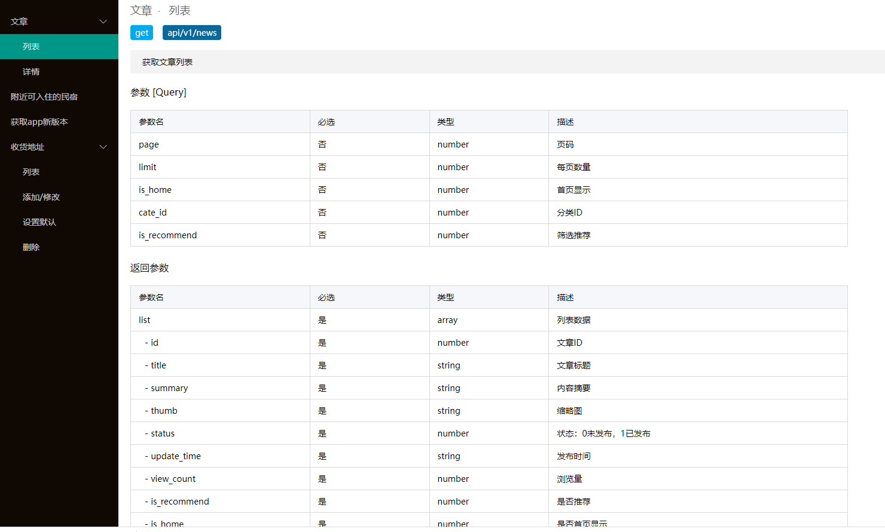

## ke/apidoc

一个0侵入性的php接口文档生成助手，默认支持Thinkphp5.1，需要支持更多，自行配置解析器即可(根据./parse/Thinkphp.php修改，很简单)。

安装

```
composer require ke/apidoc
或
composer require ke/apidoc dev-master
```

1. [查看注解使用说明](./docs/README.md)
2. [查看Parse完整配置](./docs/parse.md)

ThinkPHP使用

```
// command.php
return [
    \app\command\ApiDoc::class,
];

// app/command/ApiDoc.php
<?php
namespace app\command;


use ke\apidoc\Parse;
use think\console\Command;
use think\console\Input;
use think\console\Output;
use think\facade\App;

class ApiDoc extends Command
{
    public function configure()
    {
        $this->setName('apidoc');
    }


    public function execute(Input $input, Output $output)
    {
        (new Parse([
            'title'=>'XX接口文档',
            'api'=>false, // 如果需要json列表，赋予一个路径就可以
            'html'=>App::getRootPath() . 'api.html', // 设为false则不会生成html
        ]))->execute();
    }

}
```

命令行生成静态文档文件
```
php think apidoc
```


